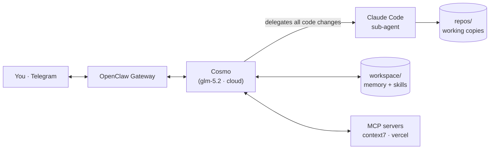
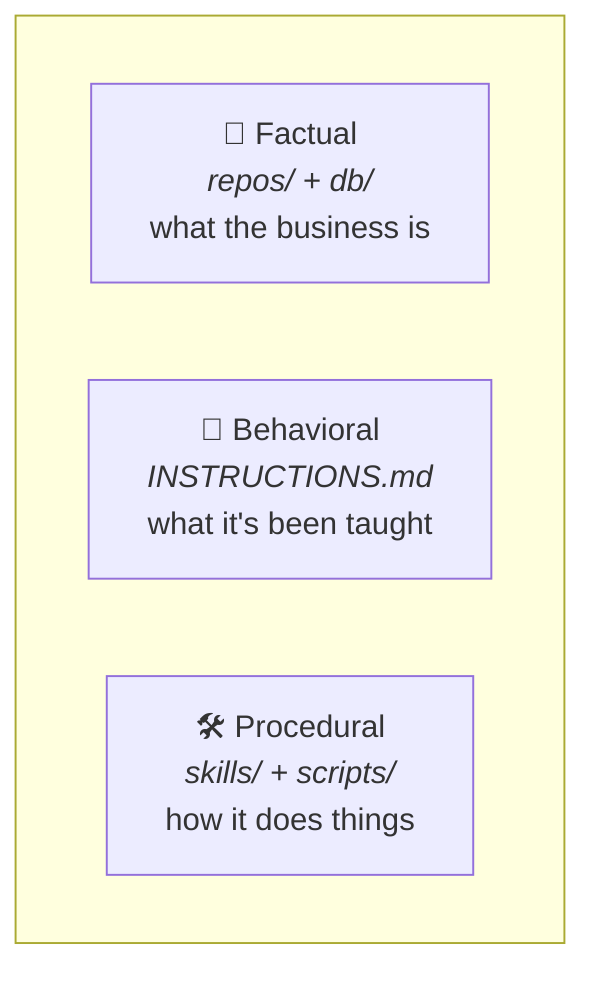
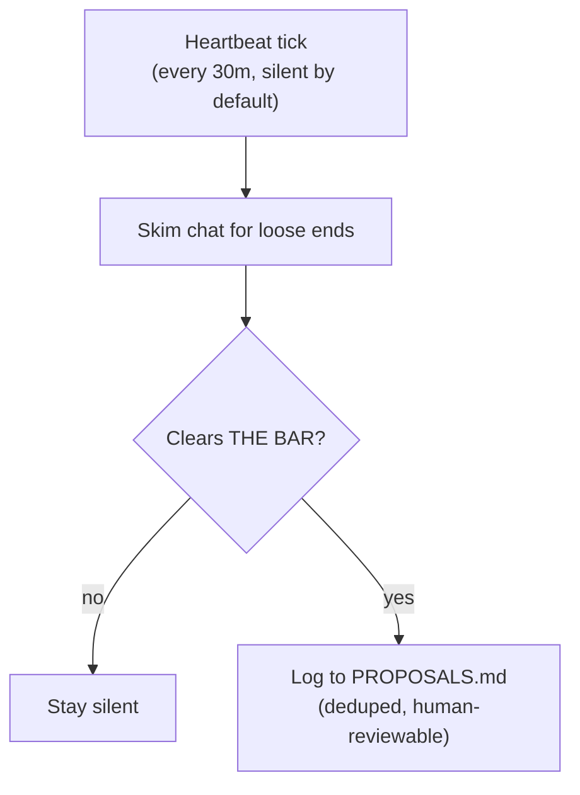
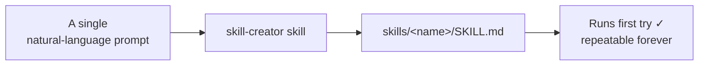

# 🌌 Cosmo — a self-evolving internal ops agent on OpenClaw

Cosmo is an **internal chief-of-staff agent** built on [OpenClaw](https://openclaw.ai). It lives in
the team's Telegram, stays mostly silent, runs a proactive heartbeat loop, edits its own memory as it
learns, and delegates real code changes to a Claude Code sub-agent. It runs on a **cost-0 cloud model**
(`glm-5.2` via the local Ollama daemon).

This repository is the **generalized, sharable config** — every personal/secret value is a placeholder
(see [Configuration](#configuration)). It's the skeleton you'd drop into `~/.openclaw/` and fill in.

> 📄 Want to read every file in one place? See **[`SPEC.md`](./SPEC.md)** — the full contents of every
> file in this repo, reproduced verbatim and auto-generated so it never drifts.

---

## Architecture



The agent itself never edits repo code — it reads, decides, and hands the actual change to a Claude
Code sub-agent. Everything Cosmo *is* lives in `workspace/`: its constitution, its memory, and its
skills.

## The three memories

Cosmo is built around the idea that an agent needs three kinds of memory, each in its own place:



- **Factual** — working copies of the real repos and a disposable DB dump it can read.
- **Behavioral** — `INSTRUCTIONS.md`, read every session and appended to whenever it's corrected.
  This is how it *self-evolves*.
- **Procedural** — `skills/` (recipes it follows) and `scripts/` (tools it builds for itself).
  This is how it *self-extends*.

## The proactive loop



A heartbeat fires on a timer, batches the intraday awareness sweeps, and **defaults to silence**.
Anything worth a human's attention is logged to a single, deduped, human-reviewable ledger
(`PROPOSALS.md`). Quiet hours and the interval are config knobs.

---

## Extending Cosmo: custom skills built with `skill-creator` 🚀

The part I'm proudest of: **how trivially this stack extends itself.**

Using the **`skill-creator` skill**, I generated a whole set of custom, business-specific skills —
**each from a single natural-language prompt.** No boilerplate, no fiddling. I described the workflow
I wanted, skill-creator wrote the `SKILL.md`, and it **ran first try, flawlessly.** Repeatable skills
*and* multi-step workflows came out the same way — one prompt each.



The skills I created this way (kept out of this generalized config because they're tied to my own
infra, but documented here as a record of what the stack can do):

| Skill | What one prompt produced |
|---|---|
| **`monitor`** | Health check for the site — returns `DOWN` on any non-2xx/timeout so the heartbeat can react. |
| **`daily-digest`** | A once-a-day cron job that posts open proposals + a "where things stand" summary, then closes what it reported. |
| **`sync-db`** | Refreshes the disposable Supabase copy in `db/` via `pg_dump`, reading creds from `.env`. |
| **`sync-repo`** | Pulls latest `main` into each repo copy, never clobbering uncommitted work. |
| **`website-fix`** | A full **autonomous workflow**: site down → spawn Claude Code → `/fix` → `/pr-review` loop (max 5) → merge only on approval → verify. |
| **`vercel-fix`** | Deploy failure → diagnose via the Vercel MCP (build logs) → fix the code or config, or roll back to the last good deploy → verify. |

That last pair are genuine end-to-end workflows — detect, fix, review, merge, verify, all
unattended — and they were authored in a single prompt apiece. That's the headline: **on this stack,
going from "I wish it could do X" to a permanent, repeatable skill is one sentence.**

> Adding a recurring job is just as easy at runtime — `skills/add-recurring-job` decides whether a new
> check belongs in the heartbeat or as a cron job and wires it in itself.

---

## What ships in this repo (the core stack)

The base skills that make the stack what it is:

| Skill | What it does |
|---|---|
| `learn` | Routes a correction to the right memory file so the next session remembers it. |
| `proposals` | Manages `PROPOSALS.md` — dedupe-check, log `OPEN`, close as `DONE`. |
| `add-recurring-job` | Sets up a recurring check (heartbeat) or scheduled job (cron); edits the right files itself. |
| `script` | Builds a permanent, reusable tool in `scripts/` instead of refusing a task. |
| `self-equip` | When blocked, searches ClawHub / GitHub / Context7 for a skill or MCP, installs it, and continues. |

## Repository layout

```
.
├── README.md            ← you are here
├── SPEC.md              ← every file's full contents, in one doc
├── openclaw.json        ← engine config (model, heartbeat timer, gateway, MCP servers)
└── workspace/           ← copied into ~/.openclaw/workspace/
    ├── AGENTS.md          constitution (loaded every session + into every sub-agent)
    ├── SOUL.md            persona & values
    ├── IDENTITY.md        who the agent is
    ├── USER.md            who the human is
    ├── INSTRUCTIONS.md    behavioral memory (learned rules + preferences)
    ├── MEMORY.md          durable business facts
    ├── PROPOSALS.md       the proposals ledger (data only)
    ├── HEARTBEAT.md       the proactive loop
    ├── TOOLS.md           local environment notes
    ├── BOOTSTRAP.md       first-run identity script (delete after setup)
    ├── .env.example       template for secrets (copy to .env — never committed)
    ├── skills/            the core skills listed above
    ├── repos/             working copies of the real repos (contents git-ignored)
    ├── db/                disposable production DB dump (contents git-ignored)
    └── scripts/           permanent tools the agent builds for itself
```

## Configuration

Everything personal or secret is a placeholder — replace each before deploying:

| Placeholder | Meaning |
|---|---|
| `<STARTUP>` | Company name |
| `<OWNER_NAME>` | Who the agent reports to |
| `<SITE_URL>` | The site URL (used by custom monitoring skills) |
| `<PRODUCT_REPO>` / `<WEBSITE_REPO>` | Repo names under `repos/` |
| `<VERCEL_PROJECT>` | Vercel project name |
| `<USER>` | Host username in the workspace path |
| `<GATEWAY_TOKEN>` | Gateway auth token — generate your own |

Real secrets never live in git: copy `workspace/.env.example` → `workspace/.env` (git-ignored) and
fill it in. Agent name (**Cosmo**), timezone, quiet hours, and the model list are kept as-is — they're
not identifying.

---

*Built on [OpenClaw](https://openclaw.ai). Code changes delegated to [Claude Code](https://claude.com/claude-code).*
