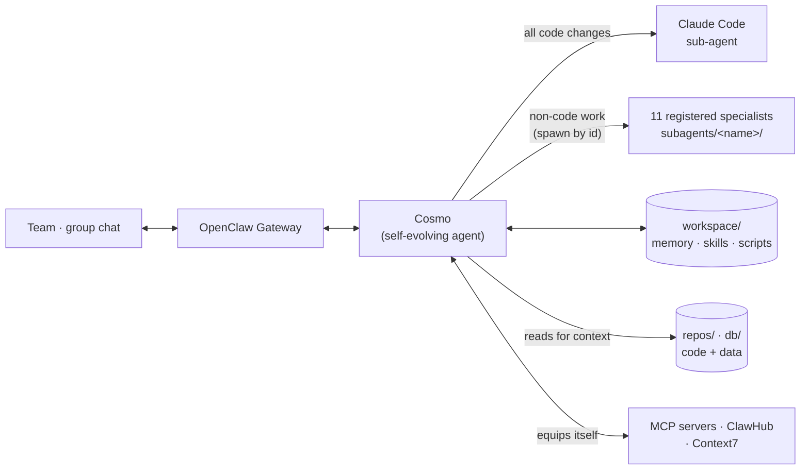
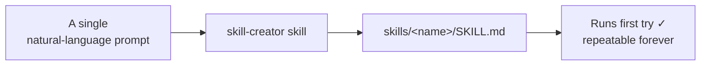
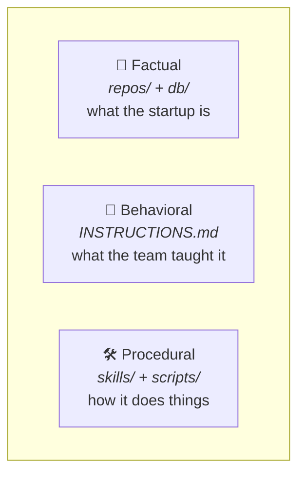
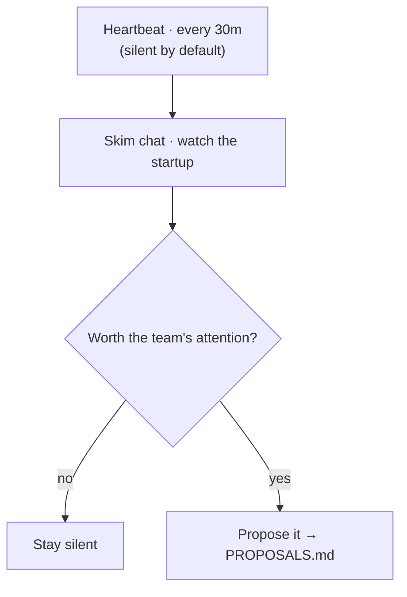

# 🌌 Cosmo: the self-evolving AI agent for startups

> An internal ops agent that lives in your team's group chat, watches everything, and acts on it:
> building its own tools, fixing your site, and reporting back, around the clock.

**Cosmo is a proactive, self-evolving internal ops agent for startups, built on
[OpenClaw](https://openclaw.ai).** It lives in the team's group chat, stays mostly silent, and runs a
proactive heartbeat every 30 minutes, quietly keeping watch over the whole company. It edits its own
behavioral memory as it learns how your team works, and delegates every code change to a Claude Code
sub-agent. Since v1.1.0 it also commands a **roster of 11 registered specialist sub-agents** —
marketing, sales, compliance, finance, support, research, data, devops and more — each a complete
markdown-defined agent of its own. Point it at your startup and it becomes the operator underneath
it: monitoring, fixing, digesting, and proposing, without being asked.

I built Cosmo to be the **central AI agent for a startup**, one that listens to everything happening
in the company and acts on it.

## How it fits together



The agent itself never edits repo code. It reads, decides, and hands the actual change to a Claude
Code sub-agent. Non-code work fans out to a registered specialist instead. Everything Cosmo *is*
lives in its `workspace/`: its constitution, its memory, and its skills.

## The sub-agent roster

Cosmo doesn't do everything itself. Eleven **complete specialist agents** live in
`workspace/subagents/<name>/` — each one a full OpenClaw agent with its own constitution, soul,
pre-named identity, behavioral memory, heartbeat file, and `skills/` folder — and each is
**registered** in `openclaw.json` (`agents.list[]`), so Cosmo spawns them by id and their workspace
loads automatically:

| Specialist | Mandate |
|---|---|
| `marketing-campaign` | plan & draft campaigns, positioning, launch plans |
| `content-writer` | blog, social, newsletter, landing copy drafts |
| `sales-lead-scraper` | find & enrich outbound leads |
| `investor-relations` | investor updates, KPI summaries, fundraising prep |
| `compliance` | legal / privacy / policy checks & flags |
| `finance-ops` | burn, runway, invoices, budgets |
| `recruiting` | source & screen candidates, JDs & outreach drafts |
| `customer-support` | triage tickets, draft replies |
| `market-research` | competitor & market sweeps |
| `data-analyst` | reason over `db/` dumps & metrics |
| `devops` | run commands & small ops scripts — never repo code |

Common skills stay in the shared `workspace/skills/` (exposed to every agent once, via
`skills.load.extraDirs`); each specialist's own `skills/` holds only its specialized procedures and
wins on a name clash. Every specialist ships with its **heartbeat off** — you enable the ones you
want during first-run setup (`BOOTSTRAP.md`) or later by hand. And the code boundary holds: a
specialist never edits repo code and never spawns Claude Code; anything code-shaped goes back
through Cosmo.

## Self-evolving, self-extending

Cosmo doesn't stop at the edge of what it can already do:

- **When Cosmo can't do a task, it builds itself a script or tool** so that it can. The tool is
  permanent and reusable the next time it comes up.
- **When Cosmo doesn't know *how* to do something, it equips itself**, installing MCP servers and
  skills from ClawHub, and referencing Context7 for up-to-date answers (if you've configured it), so
  it can get the job done instead of giving up.
- **Cosmo builds its own custom workflows**, high-quality repeatable procedures it can run over and
  over, triggered either by its heartbeat or by cron jobs.



## Built around your team

Because Cosmo is built for startups, it keeps track of the **entire team's preferences** so it does
things exactly the way the team wants. Its hard rules and standing instructions live in
`INSTRUCTIONS.md`, which it reads every session and appends to whenever it's corrected. This is how
it *self-evolves*.

It's also careful about what it remembers. **Cosmo actively filters for startup-related facts and
memory worth keeping for the record**, rather than cluttering itself with unrelated details that
don't affect how it performs for the company.



And it's proactive: **every heartbeat, Cosmo thinks about what could be improved or added** in the
startup, and brings those proposals to the team, while otherwise staying silent by default.



## Always up to date on your startup

Cosmo is only as good as what it knows, so I fed it everything:

- **Repos & databases as context.** Dedicated folders hold working copies of the startup's repos and
  read-only copies of its databases, so Cosmo always has the real code and data to reason over.
- **The team's group chat.** Add Cosmo to your Telegram group and it reads along, always aware of the
  current status of the startup.
- **RAG pipelines (recommended).** Connecting the startup's RAG pipelines to Cosmo is what really
  makes it the base layer of the company.

## What I've used Cosmo for

I've run Cosmo for real, across a range of jobs. Each one was built as a **custom skill or workflow,
generated in a single prompt** with the `skill-creator` skill, and each worked flawlessly:

- **Website health monitoring.** Checks my startup's website every heartbeat.
- **Daily digest.** A cron job that sends me the current status of the startup every morning.
- **Autonomous website repair.** When the site goes down, Cosmo spins up a Claude Code instance with
  a custom workflow to diagnose, fix, review, and redeploy it, end to end.
- **Deployment monitoring.** Watches and manages the website's deployments on Vercel.

> These are documented here as a record of what the stack can do. They're kept out of this
> generalized config because they're wired to my own infrastructure. But going from *"I wish it could
> do X"* to a permanent, repeatable skill was **one sentence each.**

## Deployment

Cosmo was built to be deployed on an **AWS EC2 instance**, but it runs on **any Ubuntu machine**. The
cloud box is entirely optional.

## Installation

The cleanest way to apply Cosmo is on a **fresh OpenClaw install** (a clean `~/.openclaw/`), so its
config and workspace drop in without colliding with an existing setup.

**Prerequisites**

- OpenClaw installed, with a runnable gateway ([openclaw.ai](https://openclaw.ai)).
- A model provider configured for the `<PROVIDER>/<MODEL>` you pick (e.g. a local Ollama daemon, or
  any provider OpenClaw supports).
- The Claude Code CLI installed and authed, if you want Cosmo to delegate code changes to a
  sub-agent.

**Steps**

1. **Drop the config blocks into `openclaw.json`.** Open `~/.openclaw/openclaw.json` and place each
   block from this repo's `openclaw.json` where it belongs (`agents.defaults`, `agents.list` — the
   registered roster — `skills`, `gateway`, `plugins`, `session`, `tools`). On a fresh install you
   can use it almost as is.
2. **Fill in the placeholders.** Search the files for `<...>` and swap each for your real value
   (`<STARTUP>`, `<OWNER_NAME>`, `<SITE_URL>`, `<USER>`, `<PROVIDER>/<MODEL>`, `<GATEWAY_TOKEN>`, …).
   Full list in [Configuration](#configuration).
3. **Copy the workspace in.** Copy everything under `workspace/` into `~/.openclaw/workspace/`. That's
   Cosmo's whole brain: its constitution, memory, and skills.

Start the gateway and you're live. On first run Cosmo walks through `BOOTSTRAP.md` — a
self-contained guided installer that fills every placeholder with you, sets identity, lets you pick
which specialists run (and whose heartbeats turn on), and ends with a short tutorial — then it
deletes that file.

---

## Repo structure

This repository is the **generalized, shareable config** behind Cosmo. Every personal or secret value
is a placeholder.

```
.
├── README.md            ← you are here (the only README in the repo)
├── openclaw.json        ← engine config (model, heartbeat, gateway, registered agents)
├── docs/                ← version specs + PRD
└── workspace/           ← copied into ~/.openclaw/workspace/
    ├── AGENTS.md          constitution (loaded every session + into every sub-agent)
    ├── SOUL.md            persona & values
    ├── IDENTITY.md        who the agent is
    ├── USER.md            who the human is
    ├── INSTRUCTIONS.md    behavioral memory (learned rules + team preferences)
    ├── MEMORY.md          durable startup facts
    ├── PROPOSALS.md       the proposals ledger (data only)
    ├── HEARTBEAT.md       the proactive loop
    ├── TOOLS.md           local environment notes
    ├── BOOTSTRAP.md       first-run guided installer + tutorial (delete after setup)
    ├── .env.example       template for secrets (copy to .env, never committed)
    ├── skills/            common skills, shared with every agent (one copy)
    ├── subagents/         the 11 registered specialists — 8 markdown files + skills/ each
    ├── repos/             working copies of the real repos (contents git-ignored)
    ├── db/                disposable production DB dump (contents git-ignored)
    └── scripts/           permanent tools the agent builds for itself
```

## Configuration

Everything personal or secret is a placeholder. Replace each before deploying:

| Placeholder | Meaning |
|---|---|
| `<STARTUP>` | Company name |
| `<OWNER_NAME>` | Who the agent reports to |
| `<SITE_URL>` | The site URL (used by custom monitoring skills) |
| `<PRODUCT_REPO>` / `<WEBSITE_REPO>` | Repo names under `repos/` |
| `<USER>` | Host username in the workspace path |
| `<PROVIDER>/<MODEL>` | The model every session and sub-agent runs on |
| `<GATEWAY_TOKEN>` | Gateway auth token (generate your own) |
| `<TIMEZONE>` | Your timezone (e.g. `Asia/Kolkata`, `America/New_York`) |
| `<HEARTBEAT_INTERVAL>` | How often the heartbeat fires (e.g. `30m`) |
| `<ACTIVE_START>` / `<ACTIVE_END>` | Hours the heartbeat may run (e.g. `00:00` / `24:00`) |

Real secrets never live in git: copy `workspace/.env.example` → `workspace/.env` (git-ignored) and
fill it in.

## Recommended MCP servers

Cosmo intentionally ships **no** MCP servers: they're specific to your accounts and stack, and a
bad one can crash the gateway. Install your own into `openclaw.json` (`mcp.servers`) — that file is
the source of truth. What tends to pay off, per agent:

| Agent | Recommended MCPs (install your own) | Enables |
|---|---|---|
| Cosmo (main) | filesystem, git, fetch/web, Context7, a deploy MCP (e.g. Vercel) | context + self-extension |
| `marketing-campaign` | LinkedIn, X/Twitter, Canva | post & design campaigns |
| `content-writer` | CMS/Notion, Google Docs | draft & publish copy |
| `sales-lead-scraper` | LinkedIn/Apollo, web search | find & enrich leads |
| `investor-relations` | Google Slides/Sheets, email | decks & updates |
| `compliance` | web search, legal/policy DB | check & flag |
| `finance-ops` | Stripe, accounting, Sheets | burn / runway / invoices |
| `recruiting` | LinkedIn, ATS, email | source & outreach |
| `customer-support` | Zendesk/Intercom, Gmail | triage & reply |
| `market-research` | web search, X/Twitter | market / competitor sweeps |
| `data-analyst` | Postgres/warehouse, Airtable | reason over data |
| `devops` | GitHub, Docker, cloud CLI, monitoring | run ops, watch infra |

---

*Built on [OpenClaw](https://openclaw.ai). Code changes delegated to
[Claude Code](https://claude.com/claude-code).*
