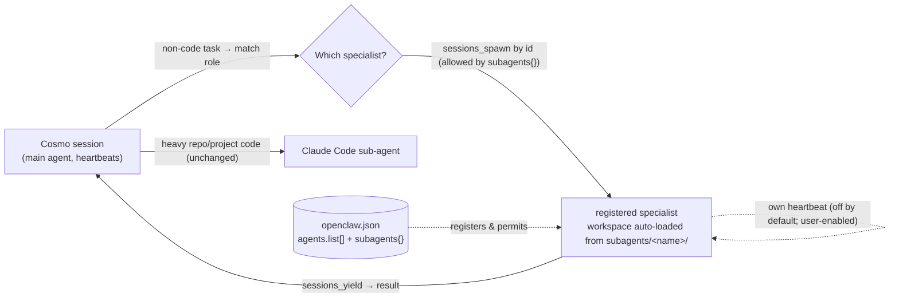

# Cosmo v1.1.0 — Sub-Agent Roster (Version Spec)

> [!summary]
> v1.1.0 adds a **roster of 11 complete, markdown-defined specialist sub-agents** for startup functions
> (marketing, sales, compliance, finance, support, research, data, **devops**, …), **registers each in
> `openclaw.json`**, gives each its **own `skills/` folder** (specialized skills) atop a shared common
> skills root, and turns **`BOOTSTRAP.md` into a self-contained installer + first-run tutorial** that
> fills every placeholder (from a full inline list), lets the user enable heartbeats for chosen
> specialists (all ship off), and teaches how to use Cosmo. Non-code work is delegated **by registered
> agent id** to the right specialist; **heavy repo/project code still goes to Claude Code**, and only
> the main agent may spawn it (devops runs commands and small scripts, but never edits repo code).

## What changed

| Area | Before → After | Why |
|---|---|---|
| Delegation model | One implicit Claude Code sub-agent (code only) → **that, plus a roster of 11 specialist sub-agents** for non-code work | A startup needs more than a coder; give Cosmo hands for marketing, sales, ops, devops, etc. |
| Workspace layout | No sub-agent definitions → new **`workspace/subagents/<name>/`**, one folder per specialist | Sub-agents are first-class, each a complete agent |
| Sub-agent definition | (none) → each folder mirrors the **main agent's full markdown file set** (AGENTS, SOUL, IDENTITY, USER, INSTRUCTIONS, MEMORY, HEARTBEAT, TOOLS) | OpenClaw's file-driven model — complete agents, no thin briefs |
| `openclaw.json` | `agents.defaults` only → **add `agents.list[]`** (main + one registered agent per specialist, **each specialist shipped `heartbeat.every: "0m"`**, i.e. off) **+ a `subagents{}` block on the main entry** (allow-list + spawn limits) | The engine must *reflect* every sub-agent; it's not purely markdown |
| Spawn mechanism | "spawn a session, tell it to read the folder" → **spawn the registered agent by its id** (workspace auto-loads); `AGENTS.md` **actively reminds the main agent every time** to use the registered specialist | OpenClaw tends to ignore registered agents even when configured — the constitution must keep steering it |
| Sub-agent heartbeats | (n/a) → **kept but shipped OFF for every specialist**; the user enables chosen ones during BOOTSTRAP (or by hand later). No per-agent cadence/target machinery — defaults apply when enabled | Dormant by default; only what the user opts into beats |
| First-run setup | `BOOTSTRAP.md` set identity only → **guided installer + tutorial**: fills every placeholder across `workspace/**` + `subagents/**` + `openclaw.json`, sets identity, **lets the user pick which specialists run now and toggle each one's heartbeat**, teaches how to use Cosmo, then self-deletes | Filling placeholders and learning the settings by hand is the painful part; make the one-time file earn its keep |
| DevOps work | Code was "all delegated to Claude Code" → **new `devops` specialist** runs commands and writes small scripts; **heavy repo/project code still goes to Claude Code** | Cosmo isn't zero-code — it may glue things with scripts/commands; it just doesn't do real repo/project engineering |
| Skills layout | Single `workspace/skills/` → **hybrid**: common skills stay shared (one copy, seen by all via `skills.load.extraDirs`) **+ each sub-agent gets its own `subagents/<name>/skills/`** for specialized skills | OpenClaw merges shared roots with per-agent workspace skills; keeps specialists organized with zero duplication |
| Per-folder READMEs | `db/`, `repos/`, `scripts/` each had a `README.md` → **removed; one README at the project root only** | Per-folder READMEs are bloat; keep a single source of narrative |
| MCP servers | Not mentioned → README gains a **Recommended MCP servers** table (per agent) | MCPs are account/stack-specific and can crash the gateway; ship none, recommend per role |
| Vendor coupling | `<VERCEL_PROJECT>` placeholder in README's Configuration → **removed** | No MCPs, plugins, or vendor-specific config ship in the project; Vercel exists only as a *recommended* MCP |
| Code path | → **unchanged**: repo/project code edits still go to the Claude Code sub-agent | Keep the safe, proven boundary intact |

## File changes (the diff)

> [!note]
> v1.1.0 is **implemented** (2026-07-19, branch `sub-agents`). This is the applied change set:
> what was **A**dded / **M**odified / **D**eleted. The `openclaw.json` shapes below were verified
> against the OpenClaw docs at build time (see the snippet). `db/`, `repos/`, and `scripts/` keep a
> bare `.gitkeep` (not a README) so the folders stay in git.

| Path | Status | What changed |
|---|---|---|
| `workspace/subagents/<name>/{AGENTS,SOUL,IDENTITY,USER,INSTRUCTIONS,MEMORY,HEARTBEAT,TOOLS}.md` | **A** | 11 specialist agents × 8 role-scoped markdown files (88 files), placeholders intact. **No** `README.md` in these folders. |
| `workspace/subagents/<name>/skills/` | **A** | Each sub-agent's own skills folder — **specialized skills only** (may start empty); common skills stay shared, not copied here |
| `openclaw.json` | **M** | `+ agents.list[]` (main entry + one per specialist, each specialist shipped `heartbeat.every: "0m"`), `+ subagents{}` on the main entry (allow-list + limits), `+ skills.load.extraDirs` (shared common-skills baseline for all agents); shapes verified against OpenClaw docs at build; `gateway`/`plugins`/`session`/`tools` untouched |
| `workspace/AGENTS.md` | **M** | `+ ## Sub-agent roster` section; generalize `## Sub-agent first`; add the devops/code nuance; leave `Editing code — STRICT` (repo code → Claude Code) intact |
| `workspace/TOOLS.md` | **M** | `+` one line under "Where the tools are" pointing at `subagents/<name>/` |
| `workspace/HEARTBEAT.md` | **M** | `+` one line: a tick may hand role-shaped work to the matching specialist (which may also run its own heartbeat) |
| `workspace/BOOTSTRAP.md` | **M** | Rewritten into a **self-contained** installer + tutorial: embedded "what Cosmo is" primer, a **full numbered table of all 12 placeholders** (secrets flagged), then fill → identity → pick specialists & heartbeats → skills/workflows/heartbeats/cron tutorial → MCPs → verify & delete. Full specification below. |
| `README.md` | **M** | Narrative → v1.1.0; `+` Sub-agent roster subsection; `+` Recommended MCP servers table; updated "How it fits together" mermaid + repo-structure tree; `−` `<VERCEL_PROJECT>` row removed from Configuration (no vendor coupling in the project) |
| `workspace/db/README.md`, `workspace/repos/README.md`, `workspace/scripts/README.md` | **D** | Per-folder READMEs removed; the project keeps a single root `README.md` |
| `docs/PRD.md` | **A** | Living-state record of the v1.1.0 decision |
| `docs/SPEC-v1.1.0.md` | **A** | This version spec |

Readable snippets of the important edits:

**`openclaw.json`** — register the roster + permit spawning (shapes **as verified against the
OpenClaw docs at build**; every specialist ships heartbeat-off via `every: "0m"` — there is no
`enabled` key):
```diff
   "agents": {
     "defaults": { "model": {...}, "workspace": "...", "heartbeat": {...} },
+    "list": [
+      { "id": "main", "name": "Cosmo", "default": true,
+        "workspace": "/home/<USER>/.openclaw/workspace",
+        "heartbeat": { "every": "<HEARTBEAT_INTERVAL>" },
+        "subagents": {                        // lives on the agent entry, not top-level
+          "allowAgents": [ /* all 11 roster ids */ ],
+          "maxConcurrent": 3, "maxSpawnDepth": 1, "archiveAfterMinutes": 60 } },
+      { "id": "marketing-campaign",
+        "workspace": "/home/<USER>/.openclaw/workspace/subagents/marketing-campaign",
+        "heartbeat": { "every": "0m" } }      // "0m" disables; BOOTSTRAP flips to a real interval
+      // …one entry per roster agent (incl. devops); model inherited from defaults
+    ]
   },
+  "skills": {
+    "load": { "extraDirs": ["/home/<USER>/.openclaw/workspace/skills"] }
+  },
```
Doc-verified deviations from the draft spec: heartbeats disable with `every: "0m"` (no
`enabled: false` key exists); the `subagents{}` block sits on the **main agent's `agents.list[]`
entry** (not top-level), which also keeps specialists from spawning each other, so `maxSpawnDepth`
is 1; the shared-skills baseline is **`skills.load.extraDirs`** (per-agent `skills` allowlists are
omitted — an agent's workspace `skills/` merges on top and wins on a name clash). The main agent is
itself registered (`id: "main"`, `default: true`) with an explicit heartbeat, because per the docs
"when any agent defines heartbeat, only those agents run heartbeats."

**`workspace/AGENTS.md`** — generalize spawning, add the roster index, keep the code boundary:
```diff
 ## Sub-agent first
-- For any real task, spawn a sub-agent and let it work, so tasks run in parallel and your
-  context stays light. Sub-agents run on your model by default and already receive this file.
+- For any non-code task, pick the matching specialist from subagents/ and spawn it, so tasks
+  run in parallel and your context stays light. Specialists run on your model by default.
+
+## Sub-agent roster
+- Complete REGISTERED agents live in subagents/<name>/ (each with its own AGENTS/SOUL/HEARTBEAT/…).
+- To delegate: match task → role, then sessions_spawn the registered agent BY ITS ID from
+  agents.list[] — its workspace loads automatically. Wait via sessions_yield.
+- ALWAYS use the registered specialist for its domain — never a generic, unregistered
+  sub-agent. Check the roster before every delegation; do not skip it.
+- Index: marketing-campaign · content-writer · sales-lead-scraper · investor-relations ·
+  compliance · finance-ops · recruiting · customer-support · market-research · data-analyst · devops.
```

The "always use the registered agent" line is not decoration: OpenClaw tends to ignore registered
agents even when they're in `openclaw.json`, so `AGENTS.md` must **actively re-steer the main agent to
the roster on every delegation**. The exact `agents.list[]` / `subagents{}` / `skills` shapes above are
intent — they get **verified against the OpenClaw docs and rewritten to match at build time**.

**`workspace/BOOTSTRAP.md`** — installer + first-run tutorial:
```diff
-# BOOTSTRAP.md - Hello, World
-_You just woke up. Time to figure out who you are._
+# BOOTSTRAP.md — First-run setup
+_You just woke up. Stand up the install, learn the ropes, then figure out who you are._
+
+## 0 — What Cosmo is  (embedded primer, so you needn't read every file)
+## 1 — Fill every placeholder  (full numbered table inline — all 12, secrets flagged)
+Collect each value conversationally, confirm the summary, then find/replace across
+workspace/** (incl. every subagents/<name>/) and openclaw.json. Secrets → .env, never echoed.
+   1. <STARTUP>  2. <OWNER_NAME>  3. <SITE_URL>  4/5. <PRODUCT_REPO>/<WEBSITE_REPO>
+   6. <USER>  7/8. <PROVIDER>/<MODEL>  9. <GATEWAY_TOKEN> (secret)
+   10. <TIMEZONE>  11. <HEARTBEAT_INTERVAL>  12. <ACTIVE_START>/<ACTIVE_END>
+## 2 — Identity  (name, creature, vibe, emoji → IDENTITY.md / USER.md / SOUL.md)
+## 3 — Pick specialists & heartbeats  (roster embedded inline; flip
+       agents.list[].heartbeat.every per agent: "0m" ↔ a real interval)
+## 4 — Short tutorial: skills (chain them → workflows) · self-built scripts ·
+       self-equipping (MCPs/ClawHub/Context7) · behavioral memory · heartbeat
+       jobs · cron jobs · proposals — with 1–2 worked examples
+## 5 — Recommended MCPs → see README; connect a channel
+## 6 — Verify (zero <...> left), restart gateway, then delete this file.
```

## New / changed architecture

Additive — the roster fans out from the existing Cosmo session; the Claude Code code path is untouched.



> [!note]
> No new engine parts. Spawning uses OpenClaw's existing `sessions_spawn` / `sessions_yield`, targeting
> the **registered agent id** — registration makes the engine load that specialist's workspace
> automatically, so there is no "read the folder first" step. Every specialist ships heartbeat-off and
> wakes only when spawned, unless the user enables its heartbeat. Specialists **never spawn Claude Code
> themselves**: they yield findings to the main agent, which owns all code delegation.

## New data / interfaces / config

- **New folders:** `workspace/subagents/<name>/` per roster agent — **no per-folder `README.md`**.
- **Per-sub-agent file set** (role-scoped, same placeholders as the main agent): `AGENTS.md`, `SOUL.md`,
  `IDENTITY.md`, `USER.md`, `INSTRUCTIONS.md`, `MEMORY.md`, `HEARTBEAT.md`, `TOOLS.md`, plus its own
  **`skills/`** folder for specialized skills.
- **Skills layout (hybrid, OpenClaw-native):** OpenClaw merges each agent's `<workspace>/skills` with
  shared skill roots (workspace wins on a name clash). So the common `workspace/skills/` is shared to all
  agents as a baseline (`skills.load.extraDirs`; allowlists omitted = unrestricted) — **one copy, no duplication**
  — while each `subagents/<name>/skills/` holds only that role's specialized skills.
- **`openclaw.json`:** `agents.list[]` (one registered agent per specialist — `id`, `workspace`,
  `heartbeat.every: "0m"` shipped, model inherited) + a `subagents{}` block on the main entry
  (`allowAgents`, `maxConcurrent`, `maxSpawnDepth`, `archiveAfterMinutes`) + `skills.load.extraDirs`
  (shared baseline). Key names/placement **verified against the OpenClaw docs at build**. No new
  secrets; only the existing `<USER>` placeholder in paths.
- **Identities are pre-named:** each specialist ships with a fixed name/creature/vibe/emoji in its
  `IDENTITY.md` (chosen at build); the user does not name sub-agents.
- **Secrets:** sub-agents may read the shared `workspace/.env` — they're full agents; the
  never-echo/never-commit rules apply to them identically.
- **Shared singletons (not replicated):** `BOOTSTRAP.md` (now the installer/tutorial), `PROPOSALS.md`,
  `.env.example`, `openclaw.json`, and the common `workspace/skills/` (shared, per above).
- **Roster (11, confirmed):** `marketing-campaign`, `content-writer`, `sales-lead-scraper`,
  `investor-relations`, `compliance`, `finance-ops`, `recruiting`, `customer-support`, `market-research`,
  `data-analyst`, `devops`.
- **Recommended MCPs (README, install-your-own):** e.g. marketing-campaign → LinkedIn/X/Canva;
  finance-ops → Stripe/accounting/Sheets; data-analyst → Postgres/Airtable; devops → GitHub/Docker/cloud
  CLI/monitoring. Cosmo ships none.

## BOOTSTRAP.md — full first-run specification

> [!important]
> `BOOTSTRAP.md` must be **fully self-contained**: the agent runs the entire setup from this one file —
> it never scans the workspace to learn what Cosmo is, which placeholders exist, or what the roster is.
> Everything below is **embedded in the file itself**.

### Phase 0 — Orientation (embedded primer, read not said)

A short embedded primer the agent reads silently before speaking: Cosmo is a proactive, self-evolving
internal ops agent for a startup; it lives in the team's group chat, runs a heartbeat, keeps three
kinds of memory (factual in `repos/`+`db/`, behavioral in `INSTRUCTIONS.md`, procedural in
`skills/`+`scripts/`), fans non-code work out to 11 registered specialists in `subagents/`, and
delegates all repo/project code to Claude Code. Plus the conversation rules: warm not robotic, one
topic at a time, never dump every question at once, never echo secrets.

### Phase 1 — Fill every placeholder

The **complete table is embedded in the file** — the agent works down it with the user, then applies:

| # | Placeholder | Ask the user | Example | Secret? |
|---|---|---|---|---|
| 1 | `<STARTUP>` | "What's the startup called?" | `Acme` | no |
| 2 | `<OWNER_NAME>` | "Who do I report to?" | `Jordan` | no |
| 3 | `<SITE_URL>` | "What's the company site?" | `https://acme.com` | no |
| 4 | `<PRODUCT_REPO>` | "Name of the product repo (under `repos/`)?" | `acme-app` | no |
| 5 | `<WEBSITE_REPO>` | "Name of the website repo (under `repos/`)?" | `acme-site` | no |
| 6 | `<USER>` | "Username on this machine (for workspace paths)?" | `ubuntu` | no |
| 7 | `<PROVIDER>` | "Which model provider?" | `anthropic` | no |
| 8 | `<MODEL>` | "Which model?" | `claude-opus-4-8` | no |
| 9 | `<GATEWAY_TOKEN>` | Don't ask — offer to **generate** one | `openssl rand -hex 32` | **yes → `.env`** |
| 10 | `<TIMEZONE>` | "Your timezone?" (IANA) | `Asia/Kolkata` | no |
| 11 | `<HEARTBEAT_INTERVAL>` | "How often should I check in on things?" | `30m` | no |
| 12 | `<ACTIVE_START>` / `<ACTIVE_END>` | "Which hours may the heartbeat run?" | `00:00` / `24:00` | no |

Procedure, spelled out in the file:
- Ask in **grouped, conversational passes** (company → repos → machine → model → schedule), validating
  formats as they come (IANA timezone, `30m`-style interval, `HH:MM` hours, a real URL).
- **Recap all values in one summary and get an explicit confirm** before touching any file.
- Then a global find/replace of each `<PLACEHOLDER>` across **`workspace/**` (including every
  `subagents/<name>/` file) and the live `openclaw.json`**.
- `<GATEWAY_TOKEN>`: generate it, copy `.env.example` → `.env` if `.env` is missing, write the token
  there, and never print it in chat.
- Close with a check: grep for any remaining `<[A-Z_]+>` — report zero, or list stragglers and resolve.

### Phase 2 — Identity

The existing conversation, kept: name, creature, vibe, emoji (offer suggestions if they're stuck) →
write `IDENTITY.md`; their name, how to address them, timezone (from Phase 1) → `USER.md`; then open
`SOUL.md` together — what matters to them, how they want Cosmo to behave, boundaries — and write it.

### Phase 3 — Pick specialists & heartbeats

The **roster is embedded inline** (11 names + one-line mandates — no folder scanning). Ask which
specialists they'll use immediately; for each chosen one, ask heartbeat **on or off** and flip
`agents.list[].heartbeat.every` in `openclaw.json` from `"0m"` to a real interval (unchosen agents
stay off). Say explicitly
that this is reversible any time by editing `openclaw.json`.

### Phase 4 — Mini-tutorial (short, embedded)

Still brief — a few sentences per capability — but it must cover what Cosmo can actually do, so the
user finishes setup knowing how to drive it:

- **Skills → workflows** — skills are permanent, repeatable procedures in `skills/`; ask for one in a
  single prompt and Cosmo builds it. Chain skills together and you have a full **workflow** — workflows
  aren't separate machinery, they're *made from skills*.
- **Self-built scripts (self-evolving)** — when Cosmo hits a task it can't do, it doesn't refuse: it
  writes itself a small script or tool in `scripts/`, permanent and reusable the next time it comes up.
- **Self-equipping** — when it doesn't know *how* to do something, it equips itself: installing MCP
  servers and ClawHub skills, and consulting Context7 for up-to-date answers (if configured), instead
  of giving up.
- **Behavioral memory** — correct Cosmo once and it appends the rule to `INSTRUCTIONS.md`, which it
  re-reads every session — the correction sticks, for the whole team's preferences.
- **Heartbeat jobs** — recurring proactive checks: a standing job in `HEARTBEAT.md` (main's or a
  specialist's) runs every tick.
- **Cron jobs** — tasks pinned to a specific time of day.
- **Proposals** — each heartbeat, Cosmo brings improvement ideas to `PROPOSALS.md` rather than acting
  unilaterally; **any specialist can get its own proposals system (and heartbeat jobs) just by asking**
  — same pattern, user-wired, not shipped.
- Close with two worked examples: *"daily 9am status digest" → cron job*; *"watch signups every tick"
  → heartbeat job in `data-analyst`'s `HEARTBEAT.md`*.

### Phase 5 — MCPs & channel

State that Cosmo ships **no** MCP servers (account/stack-specific; a bad one can crash the gateway)
and point to README's **Recommended MCP servers** table for what to install per specialist. Then
connect a channel (the existing web chat / WhatsApp / Telegram step).

### Phase 6 — Verify & finish

Re-run the placeholder grep (must be zero), remind the user to **restart the gateway** so the
`openclaw.json` changes load, then **delete `BOOTSTRAP.md`** and sign off.

## The devops specialist & the code boundary

> [!important]
> Cosmo is **not zero-code**. The `devops` specialist may **run commands** (shell/PowerShell, CLIs) and
> **write small scripts** in `scripts/` to get ops work done — this was always allowed via
> `skills/script`. What stays off-limits to every agent except Claude Code is **editing or creating
> real repo/project code** (the `Editing code — STRICT` rule is unchanged). devops does the glue; Claude
> Code does the engineering. And specialists **never spawn Claude Code themselves** — when one hits work
> that needs repo code, it yields that finding to the main agent, which owns the Claude Code path.

## Migration / impact

> [!warning]
> Additive and backward-compatible. Existing installs keep working; the repo/project code path (Claude
> Code) is untouched. To adopt: copy in `workspace/subagents/`, take the updated `AGENTS.md`/`TOOLS.md`/
> `HEARTBEAT.md`/`BOOTSTRAP.md`, drop the per-folder READMEs, and merge the new `agents.list[]` +
> `subagents{}` into `openclaw.json`. No new secrets, no data migration. On a fresh install, the
> reworked `BOOTSTRAP.md` fills all placeholders, sets heartbeats, and walks you through usage.

## Design choices this version

| Choice | Rationale |
|---|---|
| Sub-agents are **complete** agents, not thin briefs | Faithful to OpenClaw's file-driven model; each specialist has its own persona + memory |
| **Register** each specialist in `openclaw.json` (`agents.list[]` + `subagents{}`) | The engine must reflect every sub-agent; markdown alone doesn't make it spawnable |
| **Spawn by registered id** + `AGENTS.md` re-steers the main agent to the roster on every delegation | OpenClaw tends to ignore registered agents even when configured; the constitution keeps it honest |
| Sub-agent heartbeats **ship OFF**; user enables chosen ones in BOOTSTRAP | Dormant by default — only what the user opts into beats |
| Specialists **never spawn Claude Code**; they yield to the main agent | One owner of the code path; no spawn-depth complexity |
| Sub-agent identities are **pre-named** (fixed `IDENTITY.md` per specialist) | Ship complete personas; bootstrap stays short |
| Sub-agents **read the shared `workspace/.env`** | They're full agents; same never-echo/never-commit rules |
| `openclaw.json` shapes **verified against OpenClaw docs at build** | Done — the diff snippet above shows the verified shapes (`every: "0m"`, `subagents{}` on the main entry, `skills.load.extraDirs`) |
| **Hybrid skills**: shared common root + per-agent `skills/` | OpenClaw merges them natively; keeps specialists organized with zero duplication of common skills |
| `BOOTSTRAP.md` becomes a **self-contained installer + tutorial** with the full placeholder table | A one-time throwaway file is the perfect place to fill placeholders, set heartbeats, and teach usage once — without the agent scanning every file |
| Add a **`devops`** specialist; keep repo/project code with Claude Code | Cosmo may run commands and write small scripts; it just doesn't do heavy engineering |
| **One README** at the project root only | Per-folder READMEs are bloat |
| Ship **no** MCP servers; **recommend** per agent in README | MCPs are account/stack-specific and can crash the gateway — leave install to the user |
| Roster is startup-wide, not dev-only | Cosmo is company-wide ops, not just engineering |

## Fits into the full spec at

Amends [[SPEC]] → **Architecture / runtime decomposition** (roster fan-out + per-agent heartbeats),
**Project skeleton** (adds `workspace/subagents/` with per-agent `skills/`, drops per-folder READMEs),
**Configuration** (adds `agents.list[]` + `subagents{}` + `skills.load.extraDirs` and the MCP
recommendations), the **Skills** surface (hybrid shared + per-agent), the **Installation / BOOTSTRAP**
flow (now the self-contained installer + tutorial), and flips the **Where we are** "Next" item to
in-progress. The full system spec remains the whole-system baseline.
